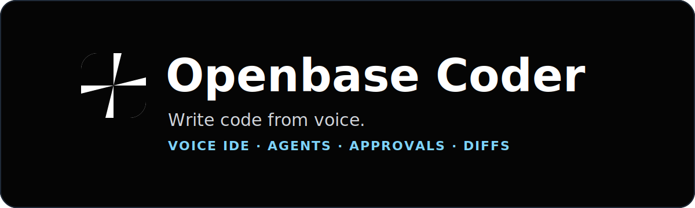

<p align="center">
  <a href="https://discord.gg/nYzsn3Vh6y"></a>
</p>

<p align="center">
  <a href="https://docs.openbase.cloud"></a>
  <a href="https://discord.gg/nYzsn3Vh6y"></a>
  <a href="https://openbase.cloud/downloads"></a>
</p>
<br>

Openbase Coder is a **voice IDE for real engineering work**. Speak a task,
keep a live coding call open, steer long-running agent threads, approve
sensitive actions, read reports, and review diffs from the same control
surface.

This repository is the main open-source entry point for Openbase Coder. It
contains the local `openbase-coder` runtime, the public product docs, the
developer setup path, and the service layer used by the Mac app, iOS app, web
console, and Openbase Cloud.

### ✏️ What You Can Do

Openbase Coder is built around the actual loop of AI-assisted engineering:
describe the change, let agents work, keep the thread moving, approve the risky
parts, and inspect the result before it lands.

Core workflows are:

* Start and steer coding work by voice through a dispatcher agent.
* Route an active voice call between the dispatcher and individual Super Agents.
* Track running, waiting, completed, and failed coding threads.
* Continue threads from the Mac app, browser console, iOS app, or CLI.
* Approve or deny agent permission requests without babysitting a terminal.
* Review live output, generated Markdown reports, and git diffs.
* Browse projects, reports, routines, skills, templates, devices, service
  health, and runtime settings from the shared dashboard.
* Use your iPhone as the remote control for calls, approvals, reports, diffs,
  and thread follow-up.
* Run the local runtime on your Mac, a Linux machine, or an Openbase Cloud
  DevSpace.
* Extend the runtime with plugins, skills, routines, bootstrap commands, and
  console pages.

### 📱 How It Fits Together

Openbase Coder has several user-facing surfaces backed by the local
`openbase-coder` runtime:

* **Mac app**: the recommended starting point. It bundles the CLI, runs guided
  setup, hosts the dashboard, manages updates, and can share your screen into
  the active voice room.
* **iOS app**: the voice and review client. Start calls, transfer voice to
  agents, follow threads, handle approvals, read reports, and inspect diffs
  from your phone.
* **Web console**: the same dashboard served in a browser by the local runtime.
* **CLI**: the local service manager and automation surface for setup, login,
  services, plugins, routines, voice routing, diagnostics, and development.
* **Openbase Cloud**: account, OAuth, device onboarding, subscriptions, and
  cloud DevSpaces.

The CLI runs the local Django API, WebSocket endpoints, LiveKit voice services,
Codex/Super Agents coordination, project and diff APIs, plugin system, bundled
agent instructions, skills, and console assets.

### 💾 Installation

Most users should install the Mac app first:

1. Download Openbase Coder for macOS from
   [openbase.cloud/downloads](https://openbase.cloud/downloads).
2. Open the app and follow guided setup. The app activates the bundled CLI,
   checks prerequisites, lets you choose a coding backend and voice provider,
   signs you in, and helps pair your iPhone over Tailscale.
3. Install the iOS beta from the Downloads page if you want the phone control
   surface for voice calls, approvals, reports, and diffs.

### 🛠️ Developer Setup

Openbase Coder is developed as a multi-repo workspace. Clone the workspace repo
for source development, even if you are mainly changing the CLI:

```bash
uv tool install multi-workspace
git clone https://github.com/openbase-community/openbase-coder-workspace
cd openbase-coder-workspace
./scripts/setup
```

The workspace setup syncs the public development repos with `multi`, builds the
console from source, and runs `openbase-coder setup --workspace-dir` against the
checkout. The CLI source for this repository lives at `cli/` inside the
workspace.

For CLI-only development after workspace setup:

```bash
cd cli
uv sync --extra dev
uv run openbase-coder --version
uv run pytest
```

If you want a persistent `openbase-coder` command backed by your checkout:

```bash
uv tool install -e ./cli
```

### 📘 Documentation

The product docs live in this repository under `docs/` and are published at
[docs.openbase.cloud](https://docs.openbase.cloud).

[Downloads](docs/downloads.md)

[Getting Started](docs/getting-started.md)

[Desktop App](docs/desktop-app.md)

[iOS App](docs/ios-tabs.md)

[Web Console and Openbase Cloud](docs/console.md)

[Commands](docs/commands/index.md)

[Configuration](docs/configuration.md)

[Troubleshooting](docs/troubleshooting.md)

### 🚀 Feedback and Contributing

Openbase Coder is in beta. Please help shape the product by opening a
[GitHub issue](https://github.com/openbase-community/openbase-coder/issues/new)
or joining the community on [Discord](https://discord.gg/nYzsn3Vh6y).

### ⚖️ License

The open-source Openbase Coder CLI/runtime is licensed under
[AGPL-3.0-only](LICENSE).
